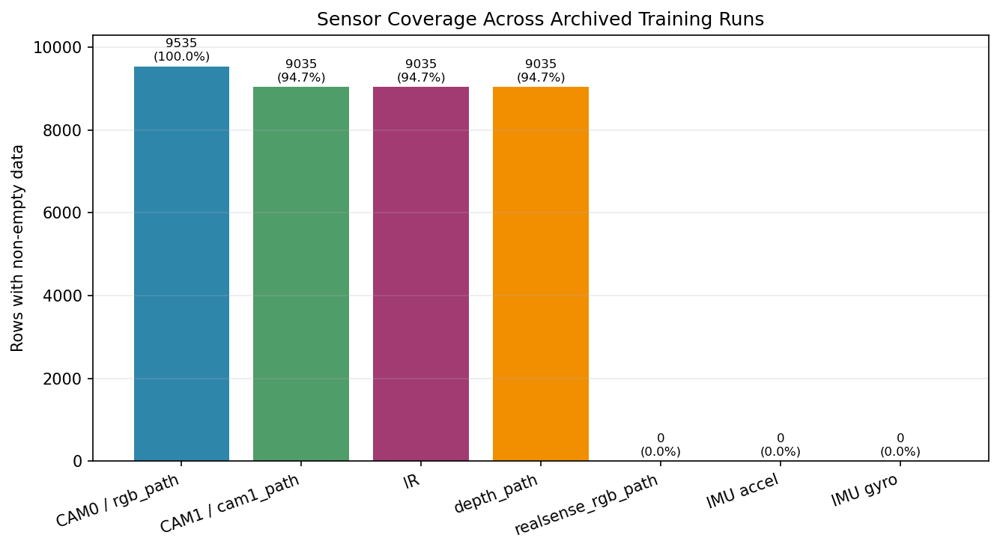
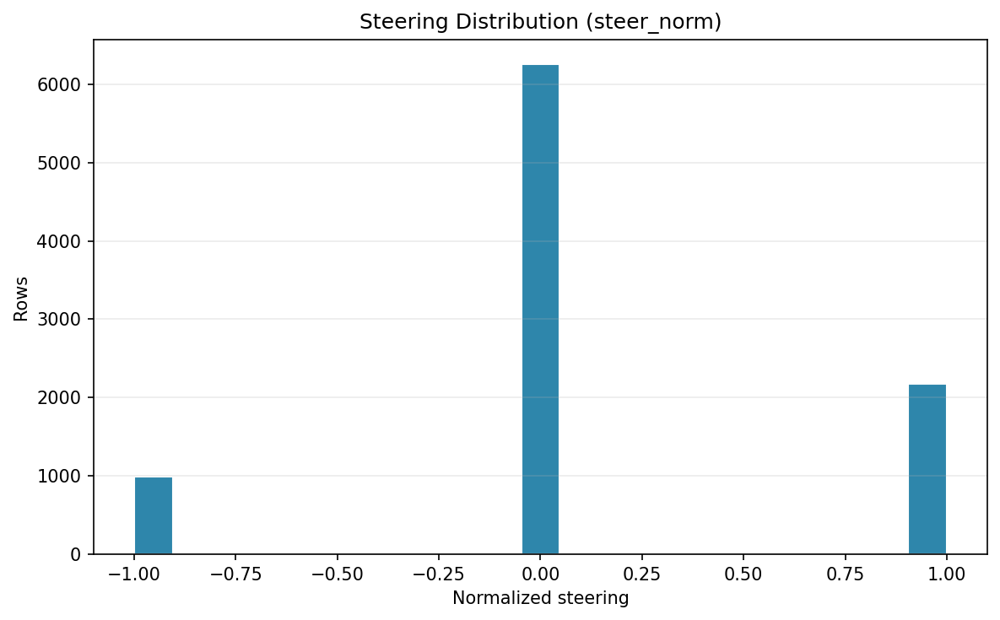
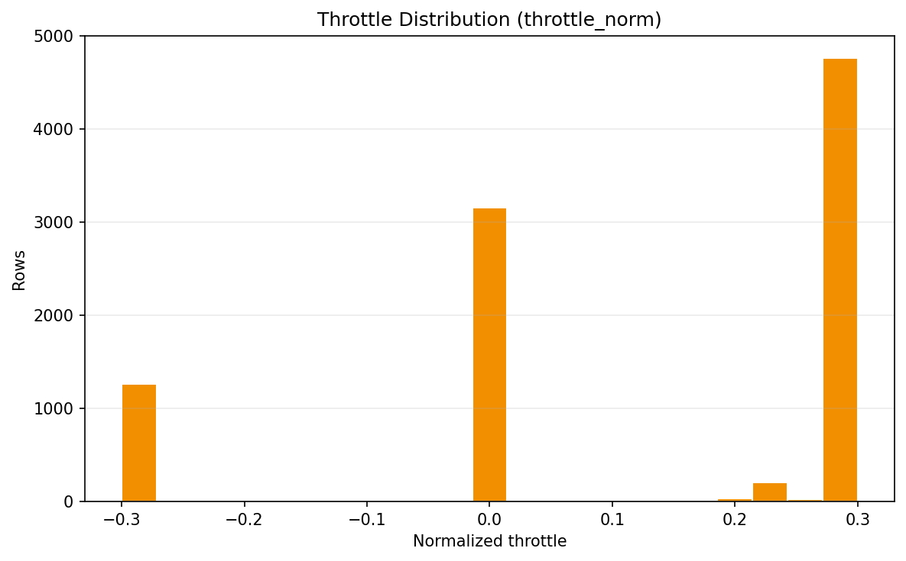
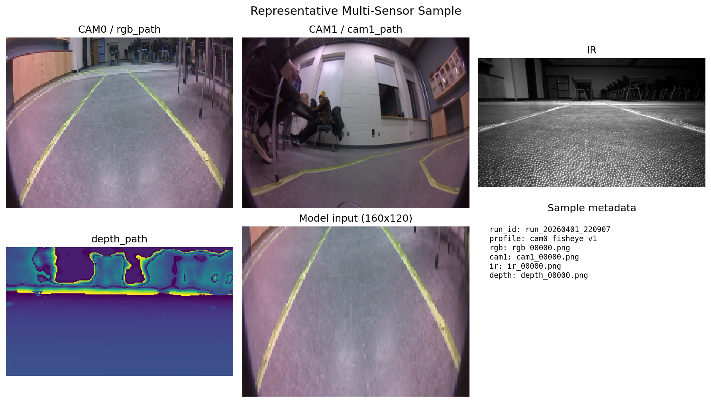
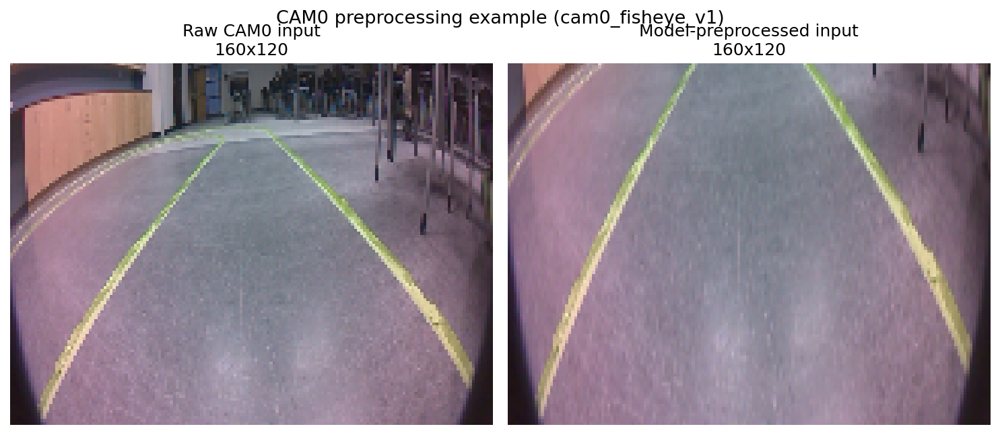

# Data EDA

This summary reflects the final tested AutoNav dataset snapshot used for repository validation.

## Dataset scope

- Run folders discovered: 17
- Total raw rows across archived dataset CSV files: 9,536
- Non-empty runs: 16
- Empty runs: 1

## Sensor coverage highlights

- CAM0/RGB coverage is effectively complete in the archived set.
- CAM1, IR, and depth are present in a subset of rows.
- IMU columns are absent in this archived snapshot.

## Distribution plots

## Representative sample and preprocessing

## Raw table artifact

The detailed per-column coverage table is preserved in [data_summary.csv](data_summary.csv).
