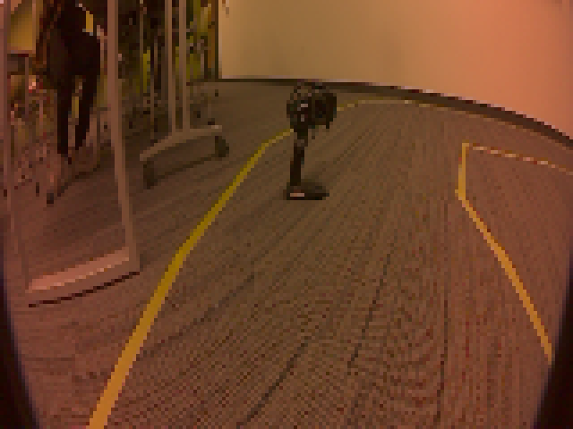

# Deployment Benchmark

This folder captures deployment benchmark documentation for the final tested AutoNav runtime.

## Validated live command path

```bash
python3 inference/run_autonomous_resnet.py \
  --arch resnet34 \
  --exp 3 \
  --camera cam0 \
  --cam-backend argus \
  --cam-sensor-id 0 \
  --controller-backend pca9685 \
  --model-path checkpoints/AutoNav-v2/AutoNav-v2-34/AutoNav-v2-34.pth \
  --trt-model-path inference/best_model_trt.pth \
  --throttle 0.20 \
  --no-invert-steering \
  --debug-timings
```

## Benchmark status

- This artifact set includes procedure and environment notes.
- Live Jetson benchmark collection should be executed on the target hardware with `tegrastats` and runtime timing logs.



## Supporting artifacts

- [tegrastats_log.txt](tegrastats_log.txt)
- [timing_log.txt](timing_log.txt)
- [generate_deployment_benchmark.py](generate_deployment_benchmark.py)
