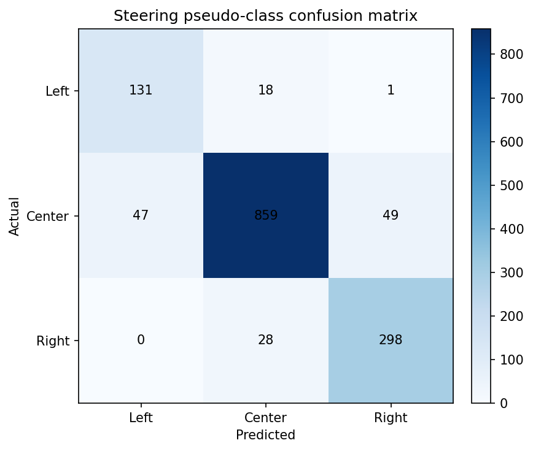
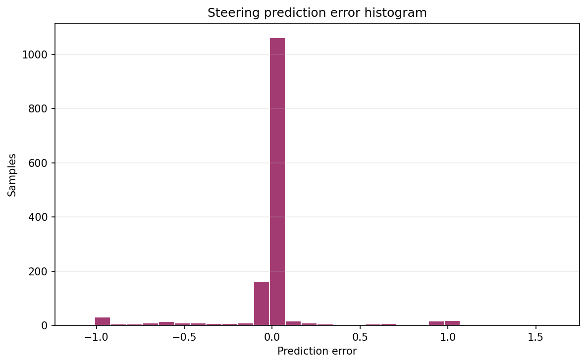
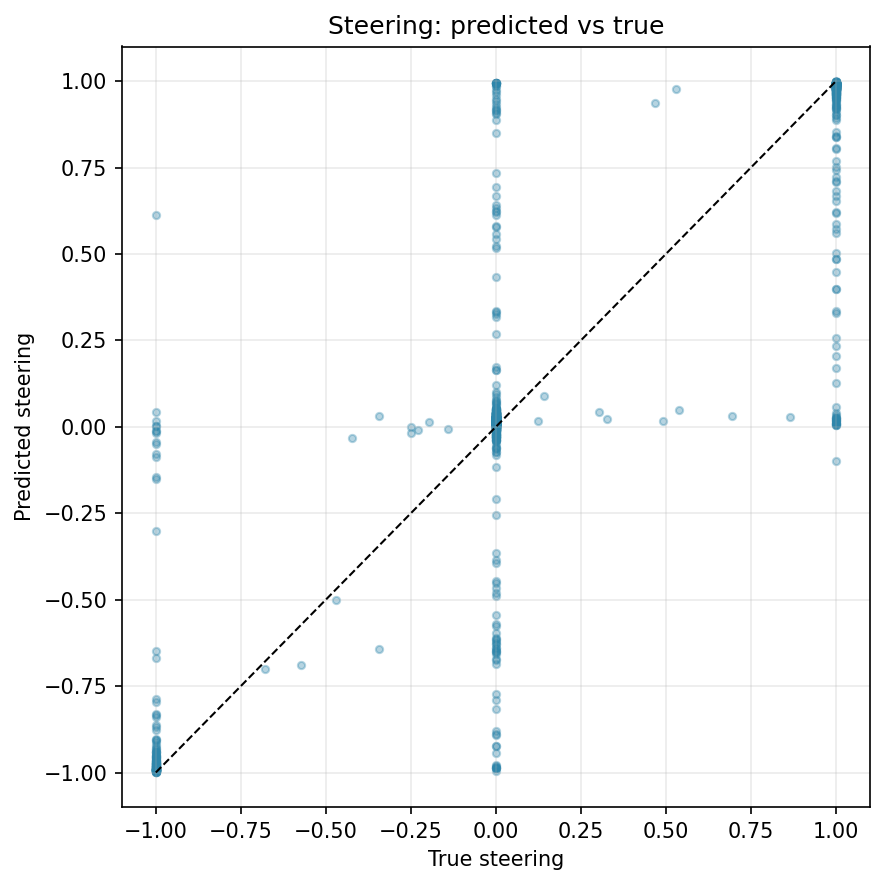
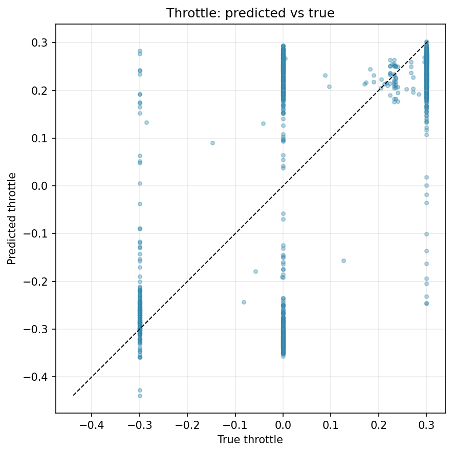

# Model Evaluation

This folder summarizes evaluation artifacts for the final tested AutoNav-v2-34 checkpoint.

## Evaluation snapshot

- Architecture: ResNet34
- Inputs: RGB (120x160)
- Output targets: normalized steering and throttle
- Test split size used for recovered evaluation: 1,431 samples

## Reported metrics

- Steering MAE: 0.1054
- Throttle MAE: 0.1287
- Combined MAE: 0.1171
- Steering pseudo-accuracy: 90.01%

## Plots

## Supporting artifacts

- [model_eval_metrics.csv](model_eval_metrics.csv)
- [model_architecture_summary.md](model_architecture_summary.md)
- [generate_model_eval.py](generate_model_eval.py)
