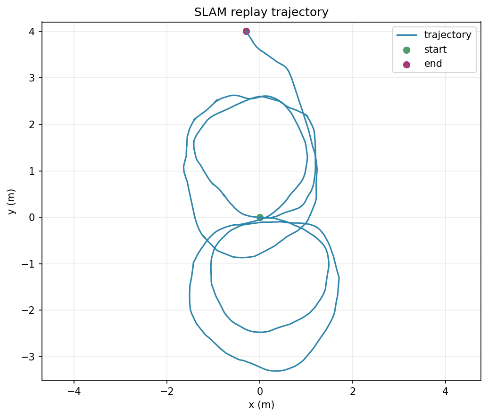
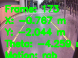

# SLAM Status

This folder documents the SLAM / RGB-D odometry prototype status in the final tested AutoNav repository.

## Current status

- Implemented as experimental odometry and replay support.
- Not positioned as production loop-closing SLAM.
- Useful for runtime state, trajectory visualization, and navigation hooks.

## Replay snapshot

- Frames processed: 3,120
- Final pose from captured replay artifact: x=-0.291, y=4.007, theta=2.087
- Motion source is primarily RGB fallback on the archived replay data

## Visual artifacts

## Supporting artifacts

- [slam_replay_metrics.csv](slam_replay_metrics.csv)
- [slam_update_rate.md](slam_update_rate.md)
- [generate_slam_artifacts.py](generate_slam_artifacts.py)
